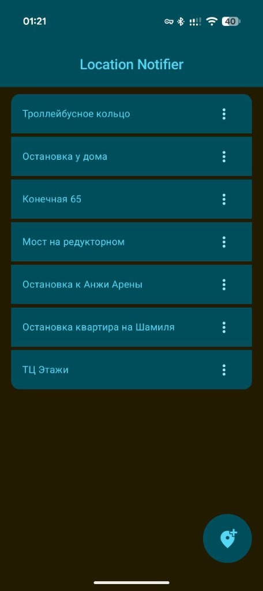
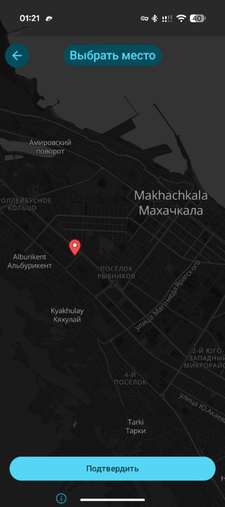
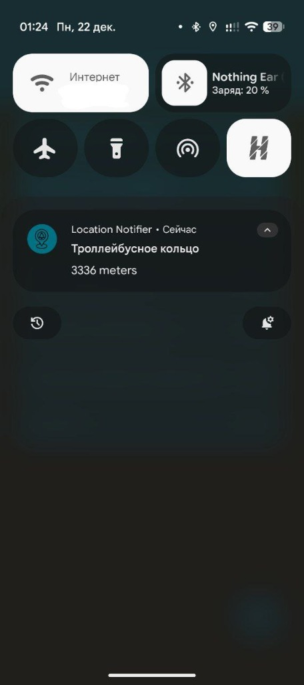

# KMM Location Notifier

    
    
    
    

## Description
This application allows users to set a specific target location point. The user can specify a distance radius, and when the device enters this radius, the app will trigger a notification and vibration to alert the user.

Key features:
- **Location Tracking**: Users can set a target location on the map.
- **Distance Notification**: The application continuously monitors the distance to the target and notifies the user with the remaining distance as they approach.
- **Customizable Radius**: Users can define the distance threshold for triggering the alert.

## Tech Stack
This is a **Kotlin Multiplatform (KMP)** project.

- **UI**: Compose Multiplatform
- **Dependency Injection**: ManualD
- **Navigation**: Compose Navigation
- **Database**: Room
- **Serialization**: Kotlinx Serialization
- **Concurrency**: Kotlin Coroutines
- **Location Services**: GMS Location (Android)
